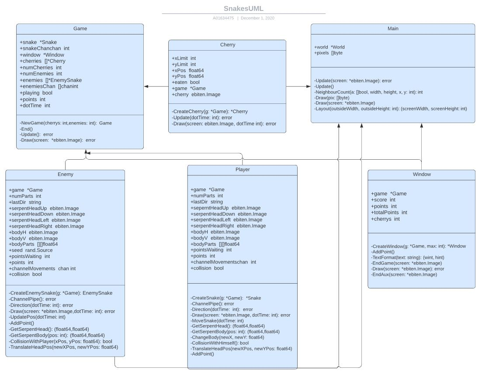

# GoSnake

Concurrent Snake Game in go.

## Architecture
**Ebiten library**

Ebiten is an open source game library for the Go programming language.

Ebiten's simple API allows you to quickly and easily develop 2D games that can be deployed across multiple platforms.

**Ebiten Game Design**

Ebiten library's `ebiten.Game`there are three necessary methods that require implementation:
* **Update**:  game logic
* **Draw**: render images in every frame. 
* **Layout**: overall game layout.
* **GAME**: Class where everything manage.

### Game Structure
We organize the project into 2 main folders and the `main.go` file: 

* root 
    * images/
    * scripts/
    * main.go

The `scripts/` The main entities needed for the game are:
* Game 
* Player
* Cherry 
* Enemy 
* Window

`game.go` will have all `ebiten.Game` interface methods implemented, in addition to the following functions and methods 
* **NewGame**: function that instanciates a new game
* **End**: method to end game.
* Logic behind cherry eats

In the image below you can see the uml

### Concurrency

We will implement a thread-safe version of the game, we create channels that can communicate with each snakes including the player.
