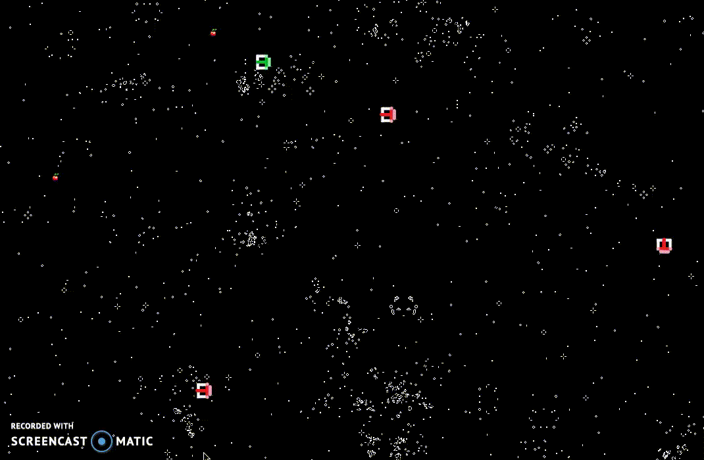

Multithreaded Snakes Game
=========================

Implement a multithreaded version of the video game Snake
The user will be able to choose the number of enemies and the number of cherrys 

Demo
----------------------

Technical Requirements
----------------------
- Install Go version 1.12 or later
- Using the standard go tools you can install Ebiten library using:
        
        $ go get -v github.com/hajimehoshi/ebiten
        
General Requirements
--------------------
In command line just write:
        
        $ go run main.go <numCherrys> <numEnemys>
  
  
Packages
-------------------- 
 * [ebiten](https://pkg.go.dev/github.com/hajimehoshi/ebiten/v2)

Video
------------
https://drive.google.com/file/d/1_lFb0mciOfHKERMheZFyNWhVw9Q-r-ny/view?usp=sharing

Presentation
------------
https://docs.google.com/presentation/d/1Y0FemubVDV_xbLFseaz8fdN9mJWPg5-bdfRl67bUkzk/edit?usp=sharing

